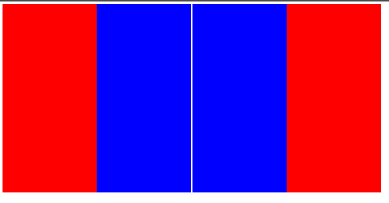

# WASM Canvas DEMO



## Install
You need to have `npm`. Then:
```
npm install
```

### Build
```
npm run build
```

There are different build scripts.
```
npm run build.clang     # requires clang
npm run build.emsdk     # requires emsdk
npm run build.d         # requires ldc
npm run build.decompile # requires wasm-decompile
npm run build.wasm2wat  # requires wasm2wat
npm run build.asmjs     # requires emsdk
```

To clean
```
npm run clean
```

### Run
After you built:
```
npm run serve
```
